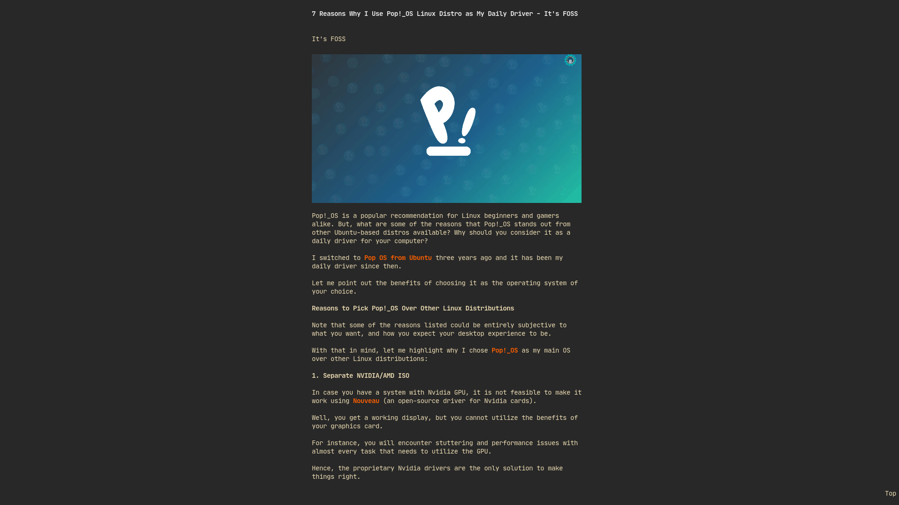

# photon


photon is a RSS/Atom reader with the focus on speed, usability and a bit of unix philosophy.


With the current state of rss readers, which are archaic, or use electron for rendering, photon wants to bring a "fresh look" within terminal, with pictures!

## Installation

You need a sixel supporting terminal emulator (I use [foot](https://codeberg.org/dnkl/foot) and started to experiment with [this branch of alacritty](https://github.com/jbenden/alacritty))

First install `go`, `git` and `scdoc`, then:

```
git clone https://git.sr.ht/~ghost08/photon
cd photon
sudo make install
```

AUR: [photon-rss-git](https://aur.archlinux.org/packages/photon-rss-git/)

    $ yay -S photon-rss-git

## Issues

File bugs and TODOs through the [issue tracker](https://todo.sr.ht/~ghost08/photon) or send an email to [~ghost08/photon@todo.sr.ht](mailto:~ghost08/photon@todo.sr.ht).

For general discussion, use the [mailing list](https://lists.sr.ht/~ghost08/photon): [~ghost08/photon@lists.sr.ht](mailto:~ghost08/photon@lists.sr.ht).

## Usage

photon's philosophy is to be a some kind of rss viewer. So it doesn't have features like adding or managing feeds. photon can be started with a list of urls:

    $ photon https://static.fsf.org/fsforg/rss/news.xml https://itsfoss.com/feed/ https://blog.golang.org/feed.atom\?format\=xml

Or it can be directly fed with the feed data:

    $ curl -s https://www.reddit.com/r/pics.rss | photon -

Or using [ratt](https://sr.ht/~ghost08/ratt) and playing magnet links directly with mpv:

    $ ratt auto https://1337x.to/top-100 | photon -

Or searching youtube using [ratt](https://sr.ht/~ghost08/ratt):

    $ ratt auto https://www.youtube.com/results --data-urlencode="search_query=MyQuery" | photon -

Or it can parse a file with feed urls separated by new line (and comments too):

    $ cat mychannels.txt
    #youtube - LunusTechTips
    https://www.youtube.com/feeds/videos.xml?user=LinusTechTips
    #youtube - Rob Braxman Tech
    https://www.youtube.com/feeds/videos.xml?channel_id=UCYVU6rModlGxvJbszCclGGw
    #odysee - Lunduke on Tech" > mychannels.txt
    https://lbryfeed.melroy.org/channel/odysee/@Lunduke:e
    $ photon mychannels.txt

Or it can call a external command, must be specified with the `cmd://` prefix:

    $ echo "cmd://ratt auto https://videoportal.joj.sk/slovania" >> mychannels.txt
    $ photon mychannels.txt

By default running photon with no arguments will try to read `~/.config/photon/config` (on windows it is `C:\Users\<Username>\.config\photon\config`).

So the feed management is up to the user with arguments, text files and creating scripts like:

    $ cat photon-reddit.sh
    photon mysubreddits.conf
    $ cat mysubreddits.conf
    https://www.reddit.com/r/popular.rss
    https://www.reddit.com/r/news.rss
    https://www.reddit.com/r/funny.rss
    https://www.reddit.com/r/memes.rss

Because photon is a "viewer" (like an image viewer, video player, ...) it doesn't have a refresh feature, doesn't have a 'item readed' feature. photon just shows the contents of the feed(s).

## Features

### card view

Always one card is highlighted, we call it `selectedCard`. To navigate to other card you can use `h`,`j`,`k`,`l` (which means: left, down, up, right).

`CTRL+-` will decrease the number of columns of cards.

`CTRL+=` will increase the number of columns of cards.

`o` will open the card's link in the default web browser (or default application).

`yy` - copy card link to clipboard

`yi` - copy the card image

`dm` - download media

`dl` - download link content

`di` - download image

`CTRL+d` - scroll half screen down

`CTRL+u` - scroll half screen up

`CTRL+f` - scroll full screen down

`CTRL+b` - scroll full screen up

`gg` - go to the first line

`G` - go to the last line

`q` - exit the application

All downloads are saved automatically to the default downloads folder `$HOME/Downloads`. This can be changed with the `--download-dir` argument.

Any keybinding can be prepended with a numeric value, like in vim. So you can type `10j` and the `selectedCard` will move 10 rows down.

### search

Searching is done with pressing `/` and then typing the query. photon will filter the visible cards by finding the query in either the card's title, description, feed's title.

### article view

By pressing `ENTER`, photon will show the article view, where it scraps the card's link and extracts the title, top image and main text content.
The article view also has three modes:

`ARTICLE` - shows the screpped article content

`DESCRIPTION` - shows the item.Description

`CONTENT` - shows the item.Content



When the article is opened:

`m` - circle trough article view mode

`j` - scroll the article down

`k` - scroll the article up

`CTRL+d` - scroll half screen down

`CTRL+u` - scroll half screen up

`CTRL+f` - scroll full screen down

`CTRL+b` - scroll full screen up

`gg` - scroll the article to the top

`G` - scroll the article to the bottom.

`q` or `Esc` - close the article.

Article view in `DESCRIPTION` or `CONTENT` mode, can use a external tool to render the text. By default `w3m` is used, but can be changed with the `--article-renderer` argument, or `PHOTON_ARTICLE_RENDERER` environment variable.

### media extraction

`p` will play the media link (in cards view)

photon is designed strongly for media viewing/playing, it will try to extract the direct media link of the card. By following the unix philosophy, [Do One Thing and Do It Well](https://en.wikipedia.org/wiki/Unix_philosophy#Do_One_Thing_and_Do_It_Well), photon want's to be just a feed viewer, so media extraction is done by external tools. By default [yt-dlp](https://github.com/yt-dlp/yt-dlp) is used. This can be changed with the `--extractor` argument or `PHOTON_EXTRACTOR` environment variable.

By the content type of the media, photon will run it in either a video player (default [mpv](https://mpv.io/)) or a image viewer (default [imv](https://github.com/eXeC64/imv)).

If the link is a magnet link, or a torrent file, photon will run it in a torrent downloader/player (default [mpv](https://mpv.io/) with the [webtorrent-mpv-hook](https://github.com/mrxdst/webtorrent-mpv-hook) script).

So you can play torrent videos directly from photon. Try: `photon https://nyaa.si/?page=rss` (and install the [webtorrent-mpv-hook](https://github.com/mrxdst/webtorrent-mpv-hook) it's awesome!).

`--image-cmd`, `--video-cmd` and `--torrent-cmd` arguments, or `PHOTON_IMAGECMD`, `PHOTON_VIDEOCMD` and `PHOTON_TORRENTCMD` environment variables, are used to change the default behavior.

### Lua plugins

photon will automatically load lua scripts from `~/.config/photon/plugins/*.lua` (on windows it is `C:\Users\<Username>\.config\photon\plugins\*.lua`).

These plugins help to extend the functionality and make photon do whatever the user needs. Lua plugins can subscribe for events or register new keybindings and modify the state. Take a look at some [user scripts](https://git.sr.ht/~ghost08/photon/tree/master/item/plugins).

example plugin:

```lua
--import the photon events module for subscribing on events
events = require("photon.events")

--subscribe to the Init event
events.subscribe(events.Init, function()
	print("Hello photon!")
end)
```

### HTTP Settings

Sometimes you need a little cookie to get the data that you want :P

For this photon has some http setting for every request that will be send:

`--cookie="KEY=VALUE;KEY=VALUE;..."` for setting cookies for all outgoing http requests

`--header="KEY=VALUE;KEY=VALUE;..."` for setting headers for all outgoing http requests

`--user-agent="myphoton"` for setting the User-Agent header for all outgoing http requests

`--insecure` ignore the ssl cert

Contribution of all kind is welcome :)
